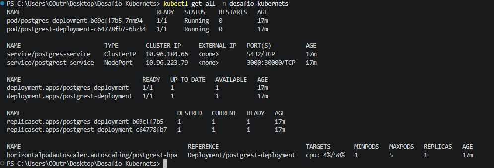
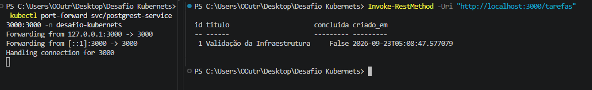
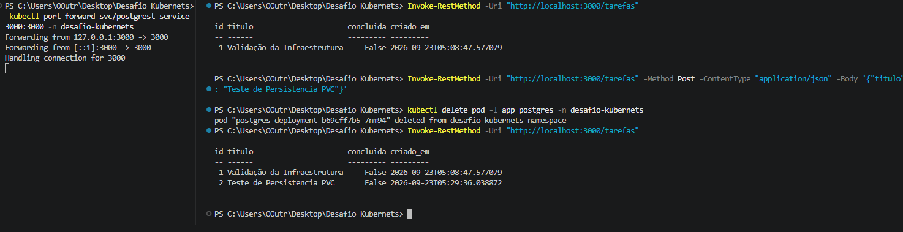

# Validações e Evidências

Este documento reúne a comprovação visual solicitada pelo desafio quanto a: implantação da infraestrutura, integração da api com o banco de dados e resiliência de dados.

## 1. Estado da Infraestrutura no Cluster

**Objetivo:** Validar que todos os recursos (Pods, Deployments, ReplicaSets, Services e HPA) foram criados corretamente e estão em estado saudável dentro do namespace isolado.

**Comando Executado:**
- ``kubectl get all -n desafio-kubernetes``
  

**Resultado:** Todos os Pods estão em execução (`1/1 Running`), os Services foram expostos corretamente e o HPA está a monitorizar as métricas de CPU ativas.
## 2. Integração entre API e Banco de Dados

**Objetivo:** Comprovar que a API PostgREST consegue comunicar com o PostgreSQL através do Service interno (postgres-service) e servir dados recebidos via requisições HTTP.

**Comandos Executados:**
- ``kubectl port-forward svc/postgrest-service 3000:3000 -n desafio-kubernetes``
- ``Invoke-RestMethod -Uri "http://localhost:3000/tarefas"``
  

**Resultado:** A API respondeu com sucesso à requisição GET via `port-forward`, retornando os registros salvos no banco de dados em formato JSON.
## 3. Teste de Persistência e Resiliência (PVC)

**Objetivo:** Provar a persistência dos dados mesmo após a exclusão e recriação do Pod do banco de dados.

**Comandos Executados:**
- ``Invoke-RestMethod -Uri "http://localhost:3000/tarefas" -Method Post -ContentType "application/json" -Body '{"titulo": "Teste de Persistencia PVC"}'``
- ``kubectl delete pod -l app=postgres -n desafio-kubernetes``
- ``Invoke-RestMethod -Uri "http://localhost:3000/tarefas"``
  

**Resultado:** Após a eliminação do Pod do PostgreSQL, o novo Pod instanciado reanexou o volume persistente, mantendo os registros (IDs 1 e 2) intactos e sem perda de dados.